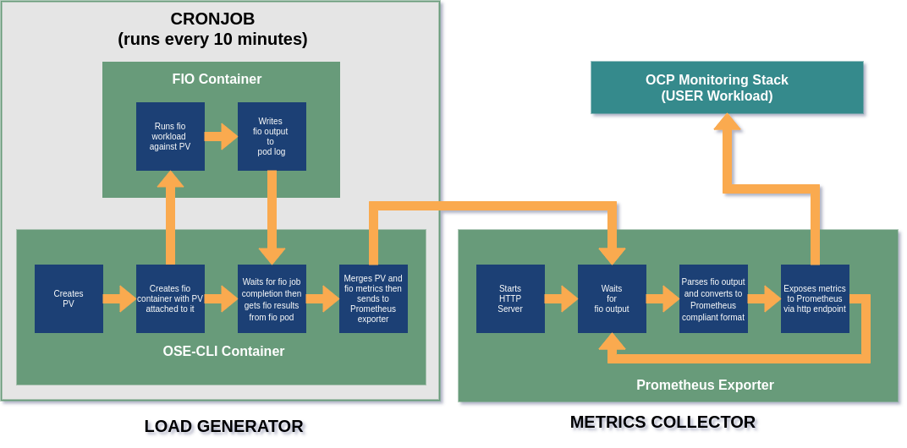
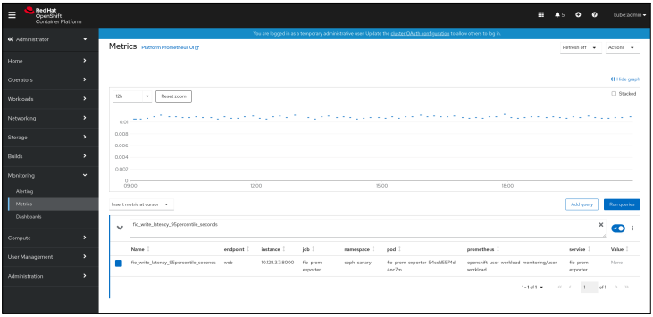

# ceph-canary

## Table of Contents
- [ceph-canary](#ceph-canary)
  - [Table of Contents](#table-of-contents)
  - [Overview](#overview)
      - [Load Generator](#load-generator)
      - [Metrics Collector](#metrics-collector)
      - [Querying Metrics in Prometheus](#querying-metrics-in-prometheus)
        - [Sample Metrics Display](#sample-metrics-display)
  - [Requirements](#requirements)
  - [Installation Steps](#installation-steps)
    - [Step 1. Cloning the git repository.](#step-1-cloning-the-git-repository)
    - [Step 2. Creating the namespace and service account.](#step-2-creating-the-namespace-and-service-account)
    - [Step 3. Installing the metrics collector.](#step-3-installing-the-metrics-collector)
    - [Step 4. Installing the load generator.](#step-4-installing-the-load-generator)
    - [Step 5. Modifying the fio workload.](#step-5-modifying-the-fio-workload)
    - [Step 6. Modifying the metrics collection.](#step-6-modifying-the-metrics-collection)
      - [Fio metrics config file fields.](#fio-metrics-config-file-fields)
      - [Default fio_metrics.conf](#default-fio_metricsconf)
      - [Sample fio-results.json](#sample-fio-resultsjson)
    - [Prometheus scrape interval.](#prometheus-scrape-interval)
  - [Setting up Alerts](#setting-up-alerts)
  - [Appendix A: How to Change the Name of the Namespace](#appendix-a-how-to-change-the-name-of-the-namespace)

## Overview
The purpose of the set of scripts in this repository is to gather I/O metrics on an Openshift Ceph storage and export the collected data to the OpenShift monitoring stack for analysis. There are two (2) major components in this package, a load generator and a metrics collector.

<<<<<<< HEAD

=======

>>>>>>> 98c5ce464b131d5caaeb9d3cb4b6497dc852976c

#### Load Generator
  The containerized load generator will run the I/O load against the storage device under test. The load generator performs the  tasks below. The tasks are scheduled using a cronjob that is set to run every 10 minutes.
  
  1. Create a persistent volume as the test storage device. 
  2. Run a containerized fio workload (fio/run_fio.sh) with a write and read verification workload against the persistent volume created above.
  3. Clean up the persistent volume and the fio workload containers after the fio job is completed.

  The load generator uses the fio tool that was written by Jens Axboe to simulate the workload mentioned in task #2 above. The default workload has a single job that writes a 1 GiB file with 1024KiB blocksize. When the write phase is completed, fio then reads the file to verify everything it wrote. The output of the fio job is written to the fio-pod log in json format which is then read and merged with the pvc creation metrics gathered from task #1. The merged result is then sent to the metrics collector.
   
   For more details on how fio works, please refer to the fio documentation below.
   
   https://fio.readthedocs.io/en/latest/fio_doc.html
   
#### Metrics Collector
   The metrics collector will collect the metrics generated from the I/O test and export it to the OpenShift Container Platform cluster monitoring stack.
   A containerized prometheus exporter app (prometheus-exporter/prometheusclient.py) will take the output from the fio job and will expose the collected metrics to the Prometheus server.

   The prometheus exporter app runs a prometheus client that parses the output from fio, converts it to a prometheus compliant format and exposes it for scraping via an http endpoint.
   
#### Querying Metrics in Prometheus
   The data collected by the metrics collector can be accessed in the Metrics UI on the OpenShift console. Please refer to the documentation below for the procedure on querying metrics.

   https://docs.openshift.com/container-platform/4.6/monitoring/managing-metrics.html#querying-metrics_managing-metrics

##### Sample Metrics Display

## Requirements
  1. The user workload monitoring must be enabled on the OCP cluster. Please refer to the OpenShift documentation below on how to do this.
     
     https://docs.openshift.com/container-platform/4.6/monitoring/enabling-monitoring-for-user-defined-projects.html

  2. The cluster must have a ceph rbd storage class.    
    
    $ oc get sc
    NAME                          PROVISIONER                             RECLAIMPOLICY   VOLUMEBINDINGMODE      ALLOWVOLUMEEXPANSION   AGE
    local-volumes                 kubernetes.io/no-provisioner            Delete          WaitForFirstConsumer   false                  29d
    ocs-storagecluster-ceph-rbd   openshift-storage.rbd.csi.ceph.com      Delete          Immediate              true                   23d
    ocs-storagecluster-ceph-rgw   openshift-storage.ceph.rook.io/bucket   Delete          Immediate              false                  23d
    ocs-storagecluster-cephfs     openshift-storage.cephfs.csi.ceph.com   Delete          Immediate              true                   23d
    openshift-storage.noobaa.io   openshift-storage.noobaa.io/obc         Delete          Immediate              false                  22d

  3. The following images must be available in the cluster's repository. 

    <cluster-repo>/fio-prom-exporter:v0.10.1
    <cluster-repo>/ose-cli:v4.7
    <cluster-repo>/fio-container:v3.26

    These images can be pulled from the following registries.  

    ose-cli:v4/7 - quay.io/gs-hosted-catalog/ose-cli
    fio-prom-exporter:v0.10.1 - quay.io/gs-hosted-catalog/fio-prom-exporter
    fio-container:v3.26 - quay.io/gs-hosted-catalog/fio-container

   4. A workstation or bastion host with oc cli client and git installed is needed. It must have access to the OCP cluster where ceph-canary will be installed.

## Installation Steps
1. Clone the ceph-canary git repository.
2. Create the project namespace and service account in Openshift.
3. Install the metrics collector component.
4. Install the load generator component.
5. Modify the fio workoad. (Optional)
6. Modify the list of fio metrics collected. (Optional)

### Step 1. Cloning the git repository.
- From the workstation, create a directory to clone the git repo to. Replace "\<local-repo\>" with the desired directory name.

      $ sudo mkdir -p ~/<localrepo>
      
      $ cd ~/<localrepo>

- Clone the ceph-canary repo.

      $ git clone https://github.com/jsangeles61/ceph-canary.git
      Cloning into 'ceph-canary'...
      remote: Enumerating objects: 658, done.
      remote: Counting objects: 100% (658/658), done.
      remote: Compressing objects: 100% (392/392), done.
      remote: Total 658 (delta 299), reused 596 (delta 256), pack-reused 0
      Receiving objects: 100% (658/658), 154.41 KiB | 760.00 KiB/s, done.
      Resolving deltas: 100% (299/299), done.

      $ ls -l ceph-canary
      total 20
      drwxrwxr-x. 2 <user> <group>    93 Apr 13 14:58 alerts
      drwxrwxr-x. 4 <user> <group>    44 Apr 13 14:16 Dockerfiles
      drwxrwxr-x. 2 <user> <group>   156 Apr 13 14:57 fio
      drwxrwxr-x. 2 <user> <group>    93 Apr 13 14:59 project
      drwxrwxr-x. 2 <user> <group>   111 Apr 13 15:01 prometheus-exporter
      -rw-rw-r--. 1 <user> <group> 16758 Apr 13 14:16 README.md
      drwxrwxr-x. 2 <user> <group>   144 Apr 13 15:00 scripts
      drwxr-xr-x. 2 <user> <group>    88 Apr 15 10:32 user-workload-monitoring

- Set the repository variable for each image mentioned in item #3 of Requirements.
    
      $ export promexporter_image="<cluster-repo>/fio-prom-exporter:v0.10.1"
     
      $ export osecli_image="<cluster-repo>/ose-cli:v4.7"
     
      $ export fiocontainer_image="<cluster-repo>/fio-container:v3.26"
     
- Set the storage variable for the storage class to be used for the persistent volume claim.

      $ export storageclass="<ceph-rbd-storage-class>"
      
- Replace the repository and storage variables in the cloned repo.

      $ cd ~/<localrepo>/ceph-canary
      
      $ scripts/replace_variables.sh

### Step 2. Creating the namespace and service account.
The default namespace for this project is ceph-canary. Unless necessary, we recommend using the default namespace. To use a different name for the namespace please follow the steps in [Appendix A: How to Change the Name of the Namespace](#appendix-a-how-to-change-the-name-of-the-namespace) before continuing.

- Log in as an admin user to the api server. 

- Go to the ceph-canary git directory.
            
      $ cd ~/<localrepo>/ceph-canary
  
- Run the script create_project.sh
  
      $ scripts/create_project.sh
      namespace/ceph-canary created
      serviceaccount/ceph-canary created
      role.rbac.authorization.k8s.io/ceph-canary created
      rolebinding.rbac.authorization.k8s.io/ceph-canary created
      Now using project "ceph-canary" on server "https://<api-server>:6443"
     
 - Verify that the ceph-canary role and rolebinding are created.

        $ oc get sa
        NAME          SECRETS   AGE
        builder       2         46s
        ceph-canary   2         46s
        default       2         46s
        deployer      2         46s
        
        $ oc get role
        NAME          CREATED AT
        ceph-canary   <creation timestamp>

        
        $ oc get rolebindings
        NAME                    ROLE                               AGE
        ceph-canary             Role/ceph-canary                   54s
        system:deployers        ClusterRole/system:deployer        54s
        system:image-builders   ClusterRole/system:image-builder   54s
        system:image-pullers    ClusterRole/system:image-puller    54s

### Step 3. Installing the metrics collector.
- Run the script install_collector.sh

      $ cd ~/<localrepo>/ceph-canary
      
      $ scripts/install_exporter.sh
      configmap/fio-metrics-conf created
      configmap/fio-prom-client created
      deployment.apps/fio-prom-exporter created
      service/fio-prom-exporter created
      servicemonitor.monitoring.coreos.com/fio-monitor created

- Verify that the prometheus exporter pod and service monitor are running.

      $ oc get po
      NAME                                 READY   STATUS    RESTARTS   AGE
      fio-prom-exporter-<xxxxxxxxxx-xxxxx>   1/1     Running   0          76s
        
      $ oc get servicemonitor
      NAME          AGE
      fio-monitor   3m31s

- Check the log from the exporter pod. It should show that the HTTP server is started and waiting for the FIO output.

      $ oc logs fio-prom-exporter-<xxxxxxxxxx-xxxxx>
      HTTP server started. Listening on port 8000.
      02:07:31: Wait for FIO output.

### Step 4. Installing the load generator. 
- Run the script install_loadgen.sh

      $ cd ~/<localrepo>/ceph-canary
      
      $ scripts/install_loadgen.sh
      configmap/fio-job created
      configmap/fio-run created
      configmap/fio-pod created
      configmap/fio-canary created
      configmap/fio-load-pvc created
      cronjob.batch/fio-cronjob created

- Verify if the cronjob is created.
    
      $ oc get cronjobs
      NAME          SCHEDULE       SUSPEND   ACTIVE   LAST SCHEDULE   AGE
      fio-cronjob   */10 * * * *   False     0        <none>          34s

### Step 5. Modifying the fio workload.
The default fio job (fio/fio_job.file) has the following global and job parameters defined.

    [global]
    name=ceph_canary_test
    directory=/mnt/pvc
    filename_format=f.$jobnum.$filenum
    write_bw_log=fio
    write_iops_log=fio
    write_lat_log=fio
    write_hist_log=fio
    log_avg_msec=1000
    log_hist_msec=1000
    clocksource=clock_gettime
    kb_base=1000
    unit_base=8
    ioengine=sync
    size=1GiB
    bs=1024KiB
    rate_iops=200
    iodepth=1
    direct=1
    numjobs=1
    ramp_time=5
    lat_percentiles=1
    
    [write]
    rw=write
    fsync_on_close=1
    create_on_open=1
    verify=sha1
    do_verify=1
  
To modify the workload, edit the configmap fio-job. 

    $ oc edit configmap fio-job

The changes to the fio-job configmap will take effect on  the next cronjob run.

Please refer to the fio documentation for the complete list of fio job parameters. 

https://fio.readthedocs.io/en/latest/fio_doc.html

### Step 6. Modifying the metrics collection.
The default metrics selected from the fio results are defined in the configmap fio-metrics-conf. The defaults metrics collected include: 
- Average write bandwidth rate in bytes per second
- Minimum write bandwidth rate in bytes per second
- Mean write IOPS
- Maximum write IOPS
- Minimum write IOPS
- Mean write latency in seconds
- Maximum write latency in seconds
- Time to create a persistent volume claim in seconds
- fio error
- Fio job runtime in seconds
- Fio write runtime in seconds
- Fio read verify runtime in seconds
- Write 95 percentile latency in seconds

To modify the list of metrics collected and exposed by the prometheus client, edit the configmap fio-metrics-conf.

    $ oc edit configmap fio-metrics-conf

Changes to the fio-metrics-conf will not take effect until the prometheus exporter pod, fio-prom-exporter-xxxxxxx, is restarted. To restart the prometheus exporter pod, run the commands below.

    $ oc scale deploy fio-prom-exporter --replicas=0
    
    $ oc scale deploy fio-prom-exporter --replicas=1

Please refer to the default fio_metrics.conf below for the format of the config file and to the sample fio-results.json file for all metrics available from the fio job output. 

#### Fio metrics config file fields.
- metric: The metric collected from the FIO job. This corresponds to the data in the json output. (Example: jobs-->write-->iops_mean = jobs/write/iops_mean)
- help: Prometheus help string.
- metric name: Prometheus metric name.
- type: Prometheus metric type - counter,gauge, summary and histogram. Note: This version currently supports gauge metric type only.
- unit: The unit prefix of the measurement of the metrics from the fio and pvc creation output. This is used by the prometheus exporter app to convert the value to the base unit for that metric. The accepted prefixes are:  
  T=Tera, G=Giga, M=Mega, K=Kilo, m=milli, u=micro, n=nano and b=base unit (This means the metric is already in its base unit and needs no conversion)

Please refer to the Prometheus documentation for more details on the data exposed by the prometheus client/exporter.

https://prometheus.io/docs/introduction/overview/

https://prometheus.io/docs/practices/naming/#base-units

#### Default fio_metrics.conf
    #metric,help,metric name,type,unit
    jobs/write/bw,Average bandwidth rate,bandwidth_avg_bytes_per_second,gauge,K
    jobs/write/bw_min,Minimum bandwidth rate,bandwidth_min_bytes_per_second,gauge,K
    jobs/write/iops_mean,IOPS Mean,iops_mean,gauge,b
    jobs/write/iops_max,IOPS Max,iops_max,gauge,b
    jobs/write/iops_min,IOPS Min,iops_min,gauge,b
    jobs/write/lat_ns/mean,Mean latency in seconds,latency_mean_seconds,gauge,n
    jobs/write/lat_ns/max,Max latency in seconds,latency_max_seconds,gauge,n
    ocs/pvc/create_time_ms,PVC creation time in seconds,create_time_seconds,gauge,m
    jobs/error,Error Code,error_id,gauge,b
    jobs/job_runtime,Job runtime in seconds,job_runtime_seconds,gauge,m
    jobs/write/runtime,Write runtime in seconds,runtime_seconds,gauge,m
    jobs/read/runtime,Read verify runtime in seconds,verify_runtime_seconds,gauge,m
    jobs/write/lat_ns/percentile/95.000000,95Percentile Latency in seconds,latency_95percentile_seconds,gauge,n

#### Sample fio-results.json
   https://github.com/jsangeles61/ceph-canary/blob/main/prometheus-exporter/fio-results.json

### Prometheus scrape interval.
The scraping interval is set at 600 seconds. To modify the prometheus scraping interval for the fio endpoint, edit the service monitor fio-monitor. Please note that the cronjob schedule and scraping interval should synchronized to avoid omission or duplication of the fio data that is sent to Prometheus.

    $ oc edit servicemonitor fio-monitor
    
    apiVersion: monitoring.coreos.com/v1
    kind: ServiceMonitor
    metadata:
      labels:
        k8s-app: fio-monitor
      name: fio-monitor
      namespace: ceph-canary 
    spec:
      endpoints:
      - interval: 600s
        port: web 
        scheme: http
      selector:
        matchLabels:
        app: fio-prom-exporter

## Setting up Alerts

Alerting rules can be created in OpenShift to fire alerts based on values collected from the fio metrics. A sample alerting rule that fires a warning alert when an error is reported in the fio json output is shown below.

    apiVersion: monitoring.coreos.com/v1
    kind: PrometheusRule
    metadata
      name: ceph-canary-fio-error 
      namespace: ceph-canary
    spec:
      groups:
      - name: fio-canary
        rules:
        - alert: FioErrorAlert
          expr: fio_error_error_id{job="fio-prom-exporter"} > 0
          labels:
            severity: Warning
          annotations:
            summary: Error encountered in Ceph Canary fio test

Alerts can be viewed and managed in the OpenShift Alerting UI. By default, alerts are not sent to any notification system but OpenShift can be configured to send the alerts to different receivers like Email and Slack. 

For more details on how to create alerting rules and sending notifications to external systems, please refer to the documents below.

 https://docs.openshift.com/container-platform/4.7/monitoring/managing-alerts.html
 https://prometheus.io/docs/prometheus/latest/configuration/alerting_rules/

## Appendix A: How to Change the Name of the Namespace

If it is necessary to change the namespace name, perform the steps below before proceeding with Step 2 of the Installation.
    
- Go to the ceph-canary git directory.
            
      $ cd ~/<localrepo>/ceph-canary
  
- Run the script change_namespace_name.sh.
  
      $ scripts/change_namespace_name.sh <desired namespace name>
      
  NOTE: If no argument is passed to the script above, the default namespace name, ceph-canary, will be used.
